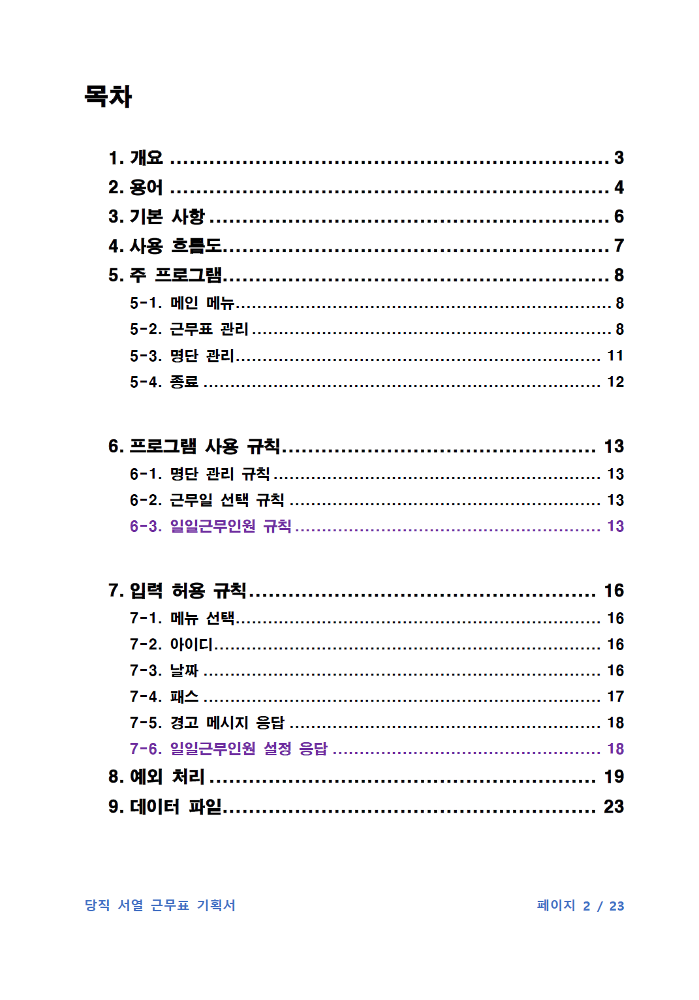

# 당직 서열 근무표

## 🗓️기간
2022.09. ~ 2025.12.

## ⚙️기술
- C++

## 📖소개
**설계**와 기획, 검사에 초점을 맞춘 프로젝트입니다.

폭포수 모델을 사용하여 개발했습니다.

## ✅기능
1. 명단 관리
2. 근무일 선택
3. 우선순위에 따라 자동 조정
4. 명단과 근무표 파일 저장

## 👥역할
- 기획 및 설계 전반
- 우선순위에 따른 선택 조정 구현
- 기능 테스트

## 🚀실행
소스 코드를 Windows Visual Studio 환경에서 실행합니다.

